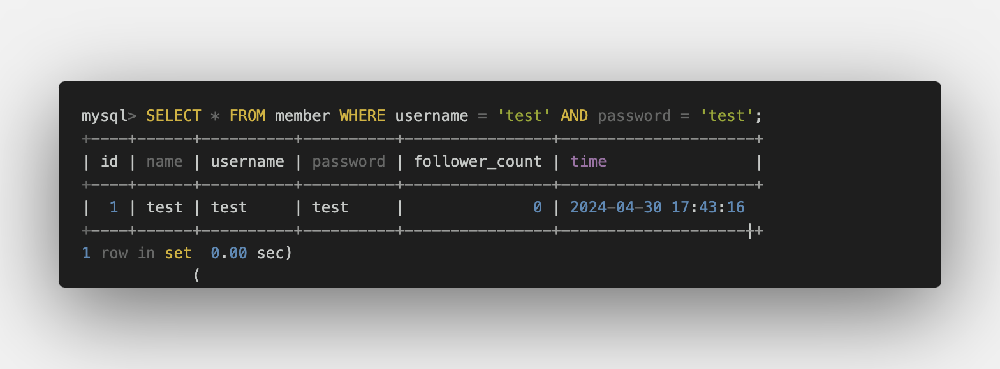

# Assignment - Week 5

## Task 2: Create database and table in your MySQL server

- Create a new database named <font color="red">website.</font>

  ```SQL
  CREATE DATABASE website;
  SHOW DATABASES;
  ```

  

- Create a new table named <font color="red">member</font>, in the <font color="red">website</font> database, designed as below:
  ```SQL
  USE website;
  CREATE TABLE member(
  	id BIGINT PRIMARY KEY AUTO_INCREMENT,
    name VARCHAR(255) NOT NULL,
  	username VARCHAR(255) NOT NULL,
  	password VARCHAR(255) NOT NULL,
    follower_count INT NOT NULL DEFAULT 0,
    time DATETIME NOT NULL DEFAULT CURRENT_TIMESTAMP
  );
  SHOW TABLES;
  ```
  

## Task 3: SQL CRUD

- INSERT a new row to the member table where name, username and password must be set to test. INSERT additional 4 rows with arbitrary data.

  ```SQL
  INSERT INTO member(name,username,password) VALUES('test','test','test');
  INSERT INTO member(name,username,password,follower_count,time) VALUES
  ('Grethel Skeemor','gskeemor0','sE2TesZVhNOl',89,'2024-04-27 22:26:20'),
  ('Domingo Gerring','dgerring1','mR4Djytn!',1,'2024-04-03 15:32:10'),
  ('Leila Gill','lgill2','wY8|erE1f',21,'2023-10-08 17:41:18'),
  ('James Hayes','kzoppo4','tT1M73wIh81',2,'2024-01-03 17:12:18');
  ```

  

- SELECT all rows from the member table.

  ```SQL
  SELECT * FROM member;
  ```

  

- SELECT all rows from the member table, in descending order of time.

  ```SQL
  SELECT * FROM member ORDER BY time DESC;
  ```

  

- SELECT total 3 rows, second to fourth, from the member table, in descending order of time. <font color="red">Note: it does not mean SELECT rows where id are 2, 3, or 4.</font>

  ```SQL
  SELECT * FROM member ORDER BY time DESC LIMIT 3 OFFSET 1;
  ```

  

- SELECT rows where username equals to test.

  ```SQL
  SELECT * FROM member WHERE username = 'test';
  ```

  

- SELECT rows where name includes the es keyword.

  ```SQL
  SELECT * FROM member WHERE name LIKE '%es%';
  ```

  

- SELECT rows where both username and password equal to test.

  ```SQL
  SELECT * FROM member WHERE username = 'test' AND password = 'test';
  ```

  

- UPDATE data in name column to test2 where username equals to test.
  ```SQL
  SET SQL_SAFE_UPDATES = 0;
  UPDATE member SET name = "test2" WHERE username = "test";
  ```
  

## Task 4: SQL Aggregation Functions

- SELECT how many rows from the member table.

  ```SQL
  SELECT COUNT(*) FROM member;
  ```

  

- SELECT the sum of follower_count of all the rows from the member table.

  ```SQL
  SELECT SUM(follower_count) FROM member;
  ```

  

- SELECT the average of follower_count of all the rows from the member table.

  ```SQL
  SELECT AVG(follower_count) FROM member;
  ```

  

- SELECT the average of follower_count of the first 2 rows, in descending order of follower_count, from the member table.
  ```SQL
  SELECT AVG(follower_count)
  FROM (
      SELECT follower_count
      FROM member
      ORDER BY follower_count DESC
      LIMIT 2
  ) AS subquery;
  ```
  

## Task 5: SQL JOIN

- Create a new table named <font color="red">message</font>, in the <font color="red">message</font> database. designed as below:

  ```SQL
  CREATE TABLE message (
    id BIGINT PRIMARY KEY AUTO_INCREMENT COMMENT 'Unique ID',
    member_id BIGINT NOT NULL COMMENT 'Member ID for Message Sender',
    FOREIGN KEY (member_id) REFERENCES member(id),
    content VARCHAR(255) NOT NULL COMMENT 'Content',
    like_count INT UNSIGNED NOT NULL DEFAULT 0 COMMENT 'Like Count',
    time DATETIME NOT NULL DEFAULT CURRENT_TIMESTAMP COMMENT 'Publish Time'
  );
  INSERT INTO message(member_id,content) VALUES (1,'Hello there!');
  INSERT INTO message(member_id,content,like_count,time) VALUES
  (2,"How's it going?",112,'2024-12-21 02:12:00'),
  (3,"What's up?",4,'2022-09-28 12:21:30'),
  (4,'Just checking in.',64,'2023-08-08 11:21:18'),
  (5,"Good morning! Have a great day ahead!",23,'2024-01-03 12:00:00');
  ```

  

- SELECT all messages, including sender names. We have to JOIN the member table to get that.

  ```SQL
  SELECT message.*, member.name AS sender_names FROM message INNER JOIN member ON member.id = message.member_id;
  ```

  

- SELECT all messages, including sender names, where sender username equals to test. We have to JOIN the member table to filter and get that.

  ```SQL
  SELECT message.*, member.name AS sender_names FROM message INNER JOIN member ON member.id = message.member_id WHERE username = "test";
  ```

  

- Use SELECT, SQL Aggregation Functions with JOIN statement, get the average like count of messages where sender username equals to test.

```SQL
SELECT AVG(message.like_count) FROM (message INNER JOIN member ON member.id = message.member_id) WHERE member.username = "test";
```


- Use SELECT, SQL Aggregation Functions with JOIN statement, get the average like count of messages GROUP BY sender username.

```SQL
SELECT member.username AS sender_names, AVG(message.like_count) AS average_like_count FROM message INNER JOIN member ON member.id = message.member_id GROUP BY member.username;
```


